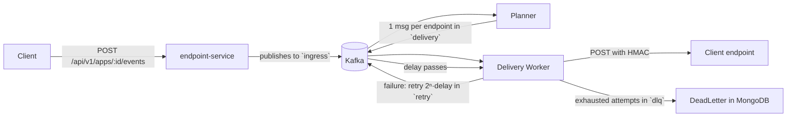

# Herald 🦍🍌

**Webhook Delivery Engine** — receives events from apps and delivers them **reliably** to clients' endpoints, even when the destination is offline or slow.

A portfolio project in microservices that replicates the webhook delivery architecture used by companies like Stripe, GitHub and Twilio: decoupling via Kafka, retry with exponential backoff, idempotency and a Dead Letter Queue.

---

## ✨ Flow



The client receives **202 Accepted** right away — delivery is **asynchronous** and decoupled by queue.

---

## 🚀 How to use

### 1. Start everything (infrastructure + apps)

```bash
docker compose up -d --build
```

Builds the 4 application images (multi-stage `Dockerfile`, one per module) and starts:

**Apps:** `gateway` (8080), `endpoint-service` (8081), `webhook-dispatcher` (8082), `retry-consumer` (8083)

**Infra:** **MySQL 8** (3306), **MongoDB 7** (27017), **Redis 7** (6379), **Kafka + Zookeeper** (9093), **Prometheus** (9090) and **Grafana** (3000, login `admin`/`admin`).

Single build of the images:

```bash
docker compose build                 # build only the app images
docker compose up -d                 # start an already-built stack
```

> Kafka uses port **9093** to avoid conflicts with other local brokers on 9092; inside the compose network the apps talk to the broker as `kafka:9092`. Prometheus/grafana run on the compose network and scrape the apps by their service names (`gateway:8080`, `endpoint-service:8081`, `webhook-dispatcher:8082`).

### 2. Alternative dev mode (apps on the host)

Same infra, apps as JVMs pointing at the published ports (handy for hot reload / debugging). Start **only the infra services** (leave the apps to the host):

```bash
docker compose up -d mysql mongodb kafka zookeeper redis prometheus grafana
./mvnw -pl gateway spring-boot:run            # :8080 (routing + rate limit)
./mvnw -pl endpoint-service spring-boot:run    # :8081
./mvnw -pl webhook-dispatcher spring-boot:run  # :8082
./mvnw -pl retry-consumer spring-boot:run      # :8083
```

> From now on requests go through the **gateway** (`localhost:8080/api/v1/**`), which does **per-app rate limiting** using the `X-App-Key` header.

### 3. Test

```bash
# create app (generates apiKey + secretHmac)
curl -X POST localhost:8080/api/v1/apps \
  -H "Content-Type: application/json" -d '{"nome":"Minha Loja"}'

# register the endpoint that will receive the webhooks
curl -X POST localhost:8080/api/v1/apps/1/endpoints \
  -H "Content-Type: application/json" -d '{"url":"https://meu-site.com/webhook"}'

# publish an event (returns 202 and delivers it reliably)
curl -X POST localhost:8080/api/v1/apps/1/events \
  -H "Content-Type: application/json" -d '{"type":"payment.confirmed","data":{"order":42}}'
```

To exercise the **rate limiting** (configurable quota in `herald.rate-limit.*`):

```bash
# exceeds the app's quota and gets 429 + Retry-After
for i in $(seq 1 50); do
  curl -s -o /dev/null -w "%{http_code} " localhost:8080/api/v1/apps \
    -H "X-App-Key: <app apiKey>"
done; echo
```

### 4. API docs (Swagger)

The API exposes **OpenAPI/Swagger UI** via `springdoc`:

- **Direct** → http://localhost:8081/swagger-ui.html
- **Through the gateway** → http://localhost:8080/swagger-ui.html

The OpenAPI JSON is served at `/v3/api-docs` (e.g. `localhost:8080/v3/api-docs`).

---

## 🧱 Architecture

Maven multi-module mono-repo:

| Module | Port | Role | Status |
|--------|-------|-------|--------|
| `common` | — | Shared DTOs and utilities (`HmacSigner`, `KafkaTopics`, `DeliveryMessage`) | ✅ |
| `endpoint-service` | 8081 | CRUD of apps/endpoints (MySQL) + validation + **event ingestion** | ✅ |
| `webhook-dispatcher` | 8082 | Input: publishes events to `ingress`. Worker: HTTP delivery with HMAC signature | ✅ |
| `retry-consumer` | 8083 | Exponential backoff and Dead Letter Queue registration | ✅ |
| `gateway` | 8080 | Routing `/api/v1/**` → services and **per-app rate limiting** (Redis) | ✅ |

### Kafka topics
| Topic | Role |
|--------|-------|
| `webhook.events.ingress` | Received events (key = `appId`) |
| `webhook.events.delivery` | Individual deliveries (1 event → 1 endpoint) |
| `webhook.events.retry` | Scheduled retry with delay |
| `webhook.events.dlq` | Events that exhausted the attempts |

### Databases
| Database | What it stores |
|-------|-------------|
| **MySQL** | Business data: apps, endpoints, keys |
| **MongoDB** | Auditing: logs of each attempt (`DeliveryAttempt`) and DLQ events (`DeadLetter`) |
| **Redis** | **Token bucket** counters for rate limiting (1 bucket per app) |

---

## 📈 Observability

Extra metrics exposed by **Micrometer** at the `/actuator/prometheus` endpoints of `endpoint-service`, `webhook-dispatcher` and `gateway`, collected by Prometheus. The delivery process metrics:

| Metric | Type | What it measures |
|---------|------|-----------|
| `herald_delivery_total{status,appId}` | counter | HTTP deliveries, by status and app |
| `herald_delivery_duration_seconds` | histogram | Delivery latency (P50/P95/P99) |
| `herald_retry_scheduled_total` | counter | Scheduled retries |
| `herald_dlq_total` | counter | Events sent to the Dead Letter Queue |

### Accessing

- **Grafana** → http://localhost:3000 — the **"Herald - Observability"** dashboard is already provisioned from `./grafana/`. Login: `admin` / `admin`.
- **Prometheus** → http://localhost:9090

The dashboard includes: delivery volume per app, P50/P95/P99 latency, success rate, retries and DLQ events. The dashboard and datasource are provisioned by files (`grafana/datasources.yml`, `grafana/dashboards-provider.yml`, `grafana/herald-dashboard.json`), so they survive `docker compose down`.

---

## 🛠️ Implemented reliability

- **Asynchronous decoupling** — immediate 202 response, intermediate queue
- **At-least-once delivery** with **exponential retry** (`2ⁿ · 10s`, configurable)
- **Idempotency** — dedup by `(eventId, endpointId)` + `Idempotency-Key` header
- **Authenticity** — `HMAC-SHA256` signature via `X-Webhook-Signature`
- **Dead Letter Queue** — irrecoverably failed events are logged with the reason
- **Timeout** — each delivery is limited to 5s
- **Per-app rate limiting** — token bucket in Redis via gateway (`X-App-Key` header), **429** response with `Retry-After`

---

## 🧪 Tests

`./mvnw clean verify` runs the whole suite with **Testcontainers**:

| Module | Coverage |
|--------|-----------|
| endpoint-service | CRUD + ingestion/validation + event reaches the topic |
| webhook-dispatcher | delivery 200/500/unavailable, routing to retry/DLQ, dedup, metrics |
| retry-consumer | resend after delay, DeadLetter persistence |
| gateway | routing `/api/v1/**`, **429** + `Retry-After`, per-app quotas (Redis) |

> Requires **Docker** running (Testcontainers).

---

## 🐳 Docker and CI/CD

### Images

The multi-stage `Dockerfile` compiles the whole reactor with Maven and packages the jar of a specific service (via `--build-arg SERVICE`):

```bash
docker build --build-arg SERVICE=gateway -t herald/gateway .
```

Services expose the same local ports (8080–8083) and read the infrastructure configuration from environment variables (e.g. `SPRING_DATA_REDIS_HOST`).

### Pipeline (GitHub Actions)

`.github/workflows/ci.yml` runs on **push/PR** and on **push to `main`**:

1. `build-test` — `./mvnw clean verify` (Testcontainers suite);
2. `docker-build` — builds and pushes the images of the 4 services to **ghcr.io** (`ghcr.io/<repo>/<service>:latest` and `:<sha>` tag).

---

## 📌 Technical notes

- Delivery is **at-least-once**: if the worker fails, the event may be delivered more than once — idempotency on the receiver protects against duplicate effects.
- The retry delay uses `Thread.sleep` in the consumer (didactic and fine for this scope); in production one would use a native delayed queue mechanism.
- App keys (signature secret) are stored and resolved **only** in the `endpoint-service` — they never travel in the body of Kafka messages.

---

**Stack:** Java 21 · Spring Boot 3.5 · Apache Kafka · MySQL · MongoDB · Redis · Prometheus/Grafana · Docker · GitHub Actions · Testcontainers

Made by [Aquinozz](https://github.com/Aquinozz) — v0.2.0